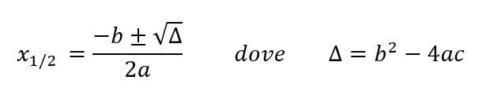

# Esercizi 04 - Funzioni

> Svolgere i seguenti esercizi definendo le funzioni richieste e svolgendo opportuni test di funzionamento.

### (A) - area-triangolo.py

Definire una funzione `area_triangolo(base, altezza)`. La funzione accetta base e altezza (in centimetri) di un triangolo e restituisce la sua area.

### (B) - potenza.py

Definire una funzione `potenza(base, esponente)`. La funzione calcola la potenza con base `base` ed esponente `esponente`
restituendo il risultato. La funzione deve effettuare tutti i controlli necessari su base ed esponente (es. numeri negativi).
Per lo svolgimento di questo esercizio viene fatto divieto dell'utilizzo dell'operatore `**`.
### (C) - fattoriale.py

In matematica il fattoriale di un numero `n` viene definito come `n! = n * (n-1) * (n-2) ...`. Il fattoriale di 5 per
esempio sarà `5! = 5 * 4 * 3 * 2 * 1`. Inoltre per definizione `0! = 1`.

Definire una funzione `fattoriale(n)` che accetta un numero intero positivo `n` e ne calcola il fattoriale restituendolo
come valore di ritorno.

### (D) - rimuovi-occorrenze.py

Definire una funzione `rimuovi_occorrenze(l, e)` che accetta una lista `l` ed un elemento `e`. La funzione restituisce una nuova
lista dalla quale sono state rimosse tutte le occorrenze di `e`.

### (E) - dati-maggiorenni.py

Definire una funzione `dati_maggiorenni(lista)`. La funzione accetta una lista di dictionary contenenti i dati di alcune persone.
Il compito della funzione è quello di restituire una nuova lista che contenga solamente i dati delle persone maggiorenni.

Si utilizzi la lista di persone fornita di seguito per effettuare i test necessari.

```python
persone = [
    {"Nome": "Mario", "Cognome": "Rossi", "Anni": 15, "Altezza": 175},
    {"Nome": "Luigi", "Cognome": "Verdi", "Anni": 23, "Altezza": 168},
    {"Nome": "Anna", "Cognome": "Bianchi", "Anni": 56, "Altezza": 181},
    {"Nome": "Luisa", "Cognome": "Rinaldi", "Anni": 16, "Altezza": 157},
    {"Nome": "Stefano", "Cognome": "Baruzzi", "Anni": 12, "Altezza": 178},
    {"Nome": "Maria", "Cognome": "Callas", "Anni": 35, "Altezza": 190}        
]
```

### (F) - equazioni.py

In matematica le soluzioni di una quazione di secondo grado del tipo `ax^2 + bx + c = 0`si calcolano tramite la seguente formula:



**IMPORTANTE**: se DELTA risulta essere minore di 0, l'equazione NON possiede soluzioni reali.

Definire una funzione `risolvi_equazione(a, b, c)` che accetta i parametri di una equazione di secondo grado e stampa su `stdout` le due possibili soluzioni.
Effettuare tutti i controlli opportuni sui parametri forniti e sul valore di delta calcolato.