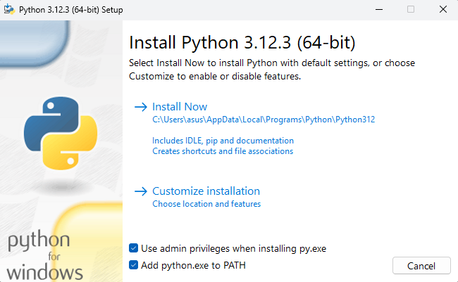
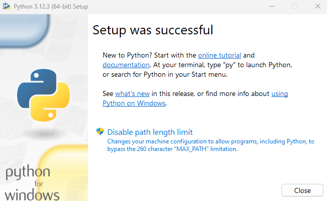
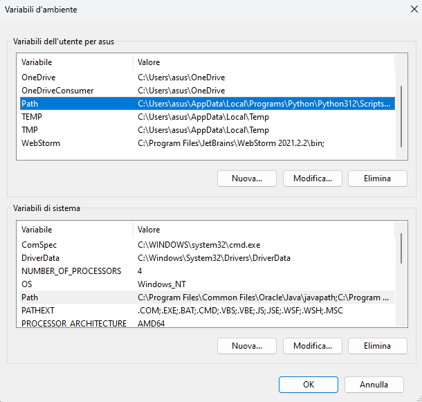
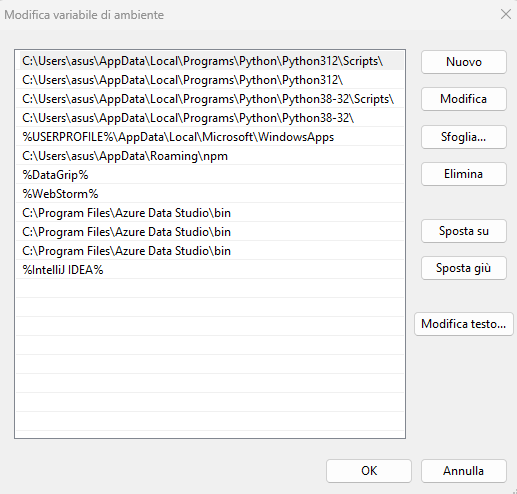

## Guida all'installazione e utilizzo di Python 3

### Downlaod

Scaricare l'installer associato al proprio sistema operativo dal [SITO UFFICIALE](https://www.python.org/downloads/).

### Installazione

1. Avviare l'installer scaricato (si trova automaticamente nella cartella download)
2. Aggiungere il comando python al PATH tramite l'apposita check-box

3. Selezionare e concludere l'installazione automatica

4. Terminare l'installazione

### Aggiunta di comandi al path

[!NOTE] Tali operazioni sono da svolgere solamente se non viene rilevato il comando `python` dal terminale.

1. Digitare nella barra di ricerca di windows "varaibili d'ambiente" e selezionare "MOdifica le variabili di ambiente relative al sistema"
2. Cliccare sul bottone `Variabili d'ambiente...`
3. Selezionare la linea con nome `PATH` tramite doppio click

4. Nella nuova finestra selezionare `Sfoglia...` e cercare l'applicazione eseguibile di Python (solitamente il percorso è `C:\Users\UTENTE\AppData\Local\Programs\Python\Python312\`) dove UTENTE è il nome dell'utente del PC.

5. Cliccare su `SALVA`