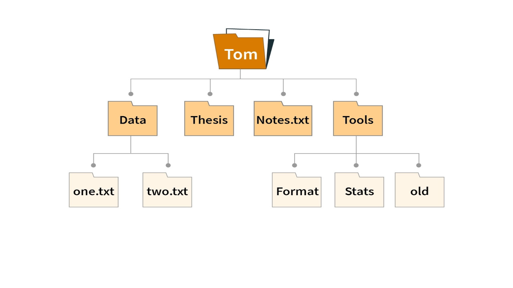

# Comandi testuali di sistema (BASH)

Il terminale è uno strumento che consente di interagire direttamente con il sistema operativo tramite l'interpretazione di comandi testuali inserti dall'utente.

Il sistema BASH è un sistema di interpretazione comandi.

## Elementi del file system

Il file system è la struttura utilizzata dal sistema operativo per gestire organizzare e archiviare i file. Esso è composto da due principali elementi

* **File**: insieme di dati archiviati sottoforma di byte.
* **Directory/Cartelle**: rappresentazione concettuale di un contenitore di file (ad essa sono associati tutti i file in essa contenuti).



Ogni elemento all'interno del file system viene identificato tramite un percorso. Esistono 3 tipi di percorsi

* **Percorso assoluto**: identifica un certo elemento a partire dalla radice (la prima cartella) del file system.
* **Percorso relativo**: identifica un certo elemento a partire dalla posizione corrente nel file system.

>[!TIP]
>
>`C/users/Mark/Desktop/file.txt` è un percorso assoluto.
>
>`Desktop/file.txt` è un percorso relativo a partire dalla directry `Mark`

### Il carattere punto (.)

Il carattere `.` viene utilizzato dal file system con significati speciali, in particolare:

* `.` identifica la directory corrente
* `..` identifica la directory che contiene la directory corrente
* `.nomefile` identifica un file nascosto

## Comandi BASH

### Spostarsi all'interno del file system

Il comando `cd` (change directory) permette di modificare la direcotry corrente (ossia di spostarsi fra le cartelle) passandogli come parametro un percorso di sistema esistente.

```bash
cd .
cd ..
cd [percorso_relativo]
cd [percorso_assoluto]
```

Il comando `pwd` (print working directory) mostra il percorso assoluto della posizione corrente.

Il comando `mkdir` (make directory) permette di creare una nuova directory nella posizione corrente.

```bash
mkdir [nome_directory]
```

Il comando `rmdir` (remove directory) permette di eliminare una directory SOLAMENTE SE VUOTA.

Il comando `ls` (list) permette di visualizzare tutti gli elementi presenti nella directory (anche nascosti) corrente con relativi dettagli in caso di utilizzo dell'opzione `-al`.

```bash
ls
ls --all
ls -al
```

### Operare con i file

Il comando `touch` permette di creare un file alla posizione corrente o al percorso specificato

```bash
touch [percorso]/nome_file
```

Il comando `cp` permette di copiare un file identificato dal percorso di partenza in un percorso di destinazione eventualmente rinominandolo.

```bash
cp percorso/nome_file nuovo_percorso/[nuovoNomeFile]
```

Il comando `mv` permette di spostare un file identificato dal percorso di partenza in un percorso di destinazione eventualmente rinominandolo.

```bash
mv percorso/nome_file nuovo_percorso/[nuovoNomeFile]
```

Il comando `rm` permette di eliminare un file identificato dal percorso dato.

```bash
cp percorso/nome_file
```

>[!NOTE]
>
>Per rimuovere una directory e i suoi elementi è possibile utilizzare il comando `rm -r` (recursive).