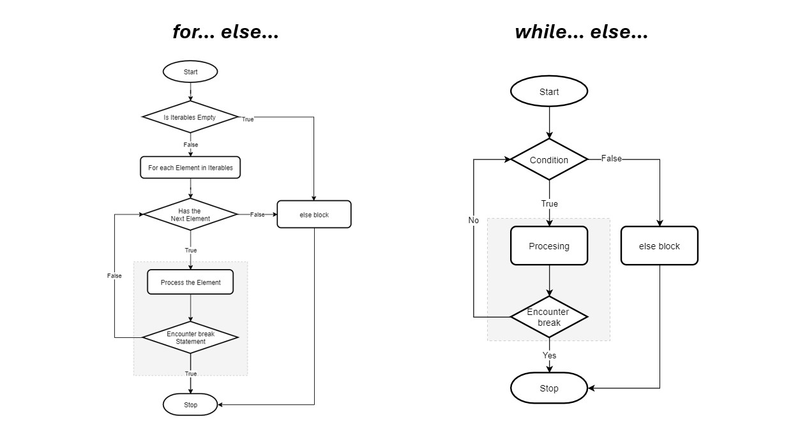

# Strutture di selezione e ripetizione

Come ogni linguaggio di programmazione python mette a disposizione vari *costrutti* o strutture che permettono di effettuare controlli o ripetere codice inserito al loro interno.

Tali strutture rappresentano i concetti di selezione e ripetizione generali trattati nel documento riferito agli algoritmi.

### Indentazione del codice

Si dice **indentazione** (o rientro) l'inserimento di una certa quantità di spazio vuoto all'inizio di una riga di testo.

```
Questa è la prima riga di testo
Questa è la seconda riga di testo indentata PARI alla prima
	Questa terza riga di testo è indentata SOTTO alla seconda riga
		Questa quarta riga di testo è indentata SOTTO alla riga precedente
Questa ultima riga è indentata PARI alla prima e alla seconda
```

>[!NOTE]
>**Nel linguaggio python l'indentazione permette di definire blocchi di codice**. Essa assume un ruolo FONDAMENTALE per lo sviluppo di programmi e per la redazione di script.


```
istruzioni iniziali

CONDIZIONE
	istruzioni da eseguire
	se si verifica la condizione

istruzioni successive
```

>[!TIP]
>In ogni caso l'indentazione è una pratica che rende il codice più leggibile, pertanto è sempre caldamente consigliato indentare correttamente il proprio codice, indipendentemente dal linguaggio di programmazione!

## Struttura di selezione - if

La struttura di selezione `if` accetta una certa condizione ed esegue le istruzioni specificate "al suo interno" solamente se la condizione specificata risulta vera.

```python
if condizione:
	#Istruzioni eseguite in caso di condizione VERA
else:
	#Istruzioni eseguite in caso di condizione FALSA
```

La struttura `if` permette di verificare diverse condizioni *in cascata* tramite l'utilizzo di `elif` (else if) come mostrato nel seguito.

```python
if c1:
	#Istruzioni eseguite in caso c1 sia VERA
elif c2:
	#Istruzioni eseguite in caso c1 sia FALSA ma c2 VERA
elif c3:
	#Istruzioni eseguite in caso c1 e c2 siano FALSE ma c3 VERA
else:
	#Istruzioni eseguite in caso di c1, c2, c3 tutte FALSE
```

>[!TIP]
>Quando si decide di utilizzare una struttura di selezione con `elif` è necessario considerare l'ordine delle condizioni poste in cascata: se alcune condizioni sono false, controlli successivi possono risultare inutili.

```python
x = 15

if x > 10:
	#Istruzione eseguita solo in caso x sia > 10
	print("Il valore x è maggiore di 10")

elif x > 12:
	#Istruzione che non sarà MAI eseguita: se x è > 12 per forza è anche > 10: si cade nel caso precedente!
	print("Questa print non viene MAI eseguita")

else:
	#Istruzione eseguita in caso x sia <= 10
	print("Il valore di x è basso")
```

## Strutture di ripetizione - cicli

Il ciclo `while` permette di ripetere le istruzioni contenute al suo interno fino al verificarsi di una certa condizione.

```python
#Istruzioni iniziali

while condizione:
	#Istruzioni da ripetere

#Istruzioni successive
```

Il ciclo `for` permette di ripetere le istruzioni contenute al suo interno per un numero finito di volte.

```python
#Istruzioni iniziali

for var in oggetto_iterabile:
	#Istruzioni da ripetere

#Istruzioni successive
```

>[!NOTE]
>Durante ciascuna iterazione del ciclo for la variabile di controllo `var` assume un valore differente!

```python
#Stampa di tutti i numeri da 1 fino a 9

for i in range(1, 10):
	print(i)
```

>[!TIP]
>Nella semantica del linguaggio python quando si esprimono gli estremi di un intervallo si considerano sempre i valori iniziali e finali secondo la seguente logica: **primo incluso, ultimo escluso**.

### PROBLEMA: implementazione del ciclo do-while

In python NON esiste un costrutto per implementare direttamente un ciclo do-while. Consideriamo quindi le informazioni in nostro possesso:

* Un ciclo do-while esegue le istruzioni in esso contenute ALMENO una volta
* Un ciclo while "standard" viene eseguito fino a quando la condizione risulta `True`
* La parola chiave `break` permette di interrompere un ciclo
* Si possono nidificare strutture di selezione e ripetizione

Vengono di seguito riportate due possibili implementazione del ciclo do-while

```python
#Impostazione di una variabile di controllo
flag = True

#Implementazione del ciclo
while flag:
    print("Sono nel ciclo")
    flag = False
print("Sono uscito dal ciclo")
```

```python
#Dichiarazione variabile con valore da incrementare
i = 0

#Implementazione del ciclo do-while
while True:
    print("Sono nel ciclo")
    if(i > 3):
        break
    else:
        i += 1
print("Sono uscito dal ciclo")
```

>[!WARNING]
>Quando si implementa un ciclo while con condizione `True` o con una variabile di controllo bisogna sempre ricordarsi di aggiornare la variabile di controllo oppure inserire la parola chiave `break` all'interno del ciclo per evitare di cadere all'interno di un **loop infinito**!

## La parola chiave `else` al termine dei cicli

L'aggiunta di della parola chiave `else` al termine di un ciclo iterativo permette di eseguire un certo blocco di istruzioni solamente se il ciclo viene completato in maniera naturale.

```python
while condizione:
    #Istruzioni del ciclo
else:
    #Istruzioni da eseguire solo se il ciclo non viene interrotto

#---------------------------------------------------------------------------#

for var in oggetto_iterabile:
    #Istruzioni del ciclo
else:
    #Istruzioni da eseguire solo se il ciclo non viene interrotto
```



>[!TIP]
> Se viene eseguita una istruzione `break` all'interno del ciclo, questo termina in modo forzato ed il blocco `else` NON viene eseguito!