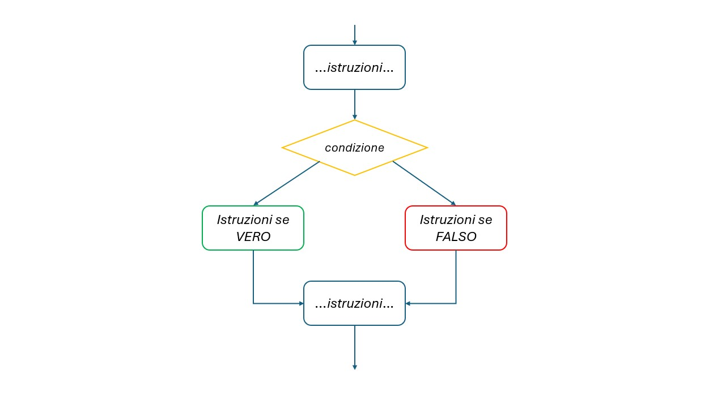
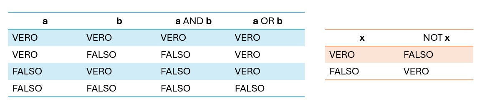
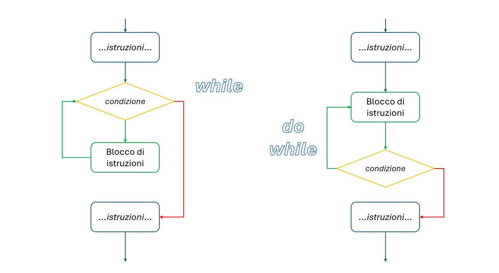
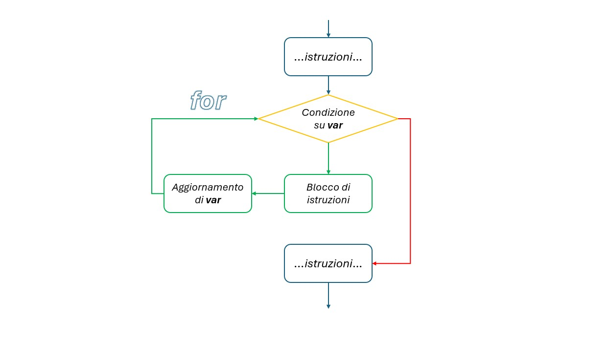

# Algoritmi

Si dice algoritmo una successione di **istruzioni** consecutive (e non ambigue) che permettono di risolvere un problema complesso. (Tramite una successione di passi semplici).

## Controllo dei dati

Gli algoritmi permettono di effettuare controlli e svolgono certe operazioni in caso di controlli favorevoli, altre in caso di controlli sfavorevoli.

>[!NOTE]
>Tutti i controlli effettuati sono sempre il risultato di una **espressione booleana**, ciò significa che il risultato di tale espressione sarà sempre *VERO* oppure *FALSO*.

### Condizioni logiche

* Operatore `NOT` --> restituisce l'OPPOSTO della condizione
* Operatore `AND` --> restituisce vero se TUTTE le condizioni sono vere
* Operatore `OR` --> restituisce vero se ALMENO una delle condizioni è vera

## Ripetizione delle operazioni

Gli algoritmi permetto di ripetere **uno stesso insieme di istruzioni** (o blocco) fino al verificarsi di una certa condizione. Ciò diventa possibile atraverso dei costrutti detti **CICLI**. Ogni volta che il blocco interno ad un ciclo viene eseguito si parla di *iterazione*.

### Tipologie di cicli iterativi

* **Cicli while**: le istruzioni contenute al loro interno vengono eseguite fino a quando la condizione predisposta è vera ossia fornisce come risultato `True`.
* **Ciclo for**: permette di ripetere le istruzini contenute al suo interno per un numero finito di volte.

### While e do-while

Viene di seguito riportato come operano i cicli iterativi:

**WHILE**
1. Si effettua un controllo sulla condizione posta
2. Se la condizione posta è vera viene eseguito il blocco di istruzioni
3. Se la condizione posta è falsa si esce dal ciclo

**DO-WHILE**
1. Viene eseguito il blocco di istruzioni
2. Si effettua un controllo sulla condizione posta
3. Se la condizione posta è vera viene ripetuto il blocco di istruzioni
4. Se la condizione posta è falsa si esce dal ciclo

>[!NOTE]
>La differenza fra il ciclo while e il ciclo do-while consiste nel fatto che il blocco di istruzioni all'interno del do-while venga eseguito ALMENO UNA VOLTA (a diferenza del ciclo while).

### Ciclo for

Il ciclo for permette di ripetere le istruzioni contenute al suo interno per un numero finito di volte. Proprio come per il ciclo while le istruzioni vengono ripetute finchè una certa condizione risulta vera. Tuttavia ad ogni iterazione si aggiorna una variabile di controllo.

Viene di seguito riportato come opera il ciclo for:

1. Si effettua un controllo sulla condizione
2. Se la condizione posta è vera viene eseguito il blocco di istruzioni
3. Viene aggiornata la variabile di controllo

