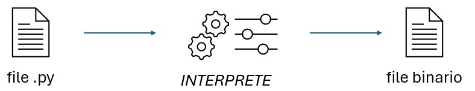
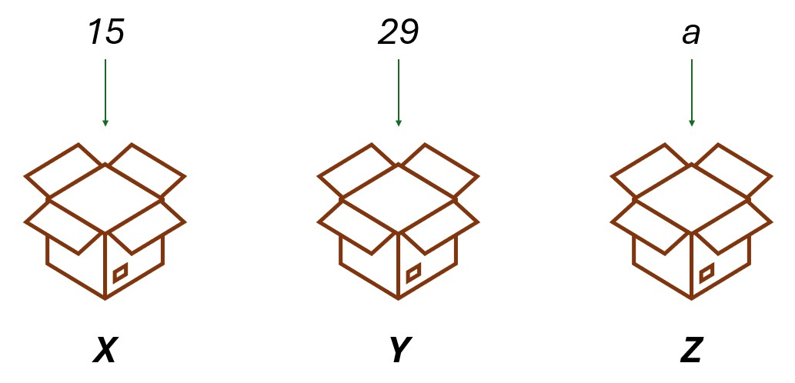
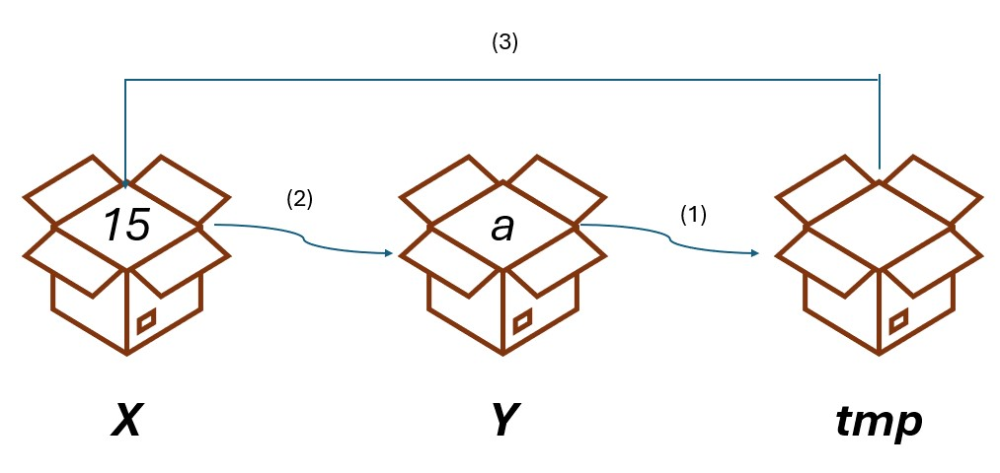

# Introduzione a python

Python è un linguaggio di programmazione **interpretato**: ogni istruzione scritta dal programmatore tramite i termini del linguaggio viene interpretata da un programma apposito (detto interprete) che la *converte* in una istruzione comprensibile per il calcolatore (che comprende il *linguaggio macchina*).



## Variabili

Una **variabile** è un contenitore di dati all'interno della memoria del dispositivo. Una variabile serve per "salvare" i dati ed è destinata ad essere utilizzata/modificata.



### Utilizzo di variabili

Per inserire dati all'intrno di variabili è possibile utilizzare l'operatore `=` ed effttuare una **assegnazione** come mostrato di seguito:

```
nome_variabile = valore
```

I dati contenuti nella variabili possono essere modificati tramite nuove assegnazioni:

```python
var = 8
var = var + 1
```

Il nuovo valore di `var` è costituito dal suo valore precedente (8) a cui viene sommato 1. Si ottiene quindi 9.

>[!TIP]
>In python le variabili possono contenere qualsiasi tipo di dato (NON sono *tipizzate*) ciò significa che esse possono contenere numeri, stringhe oppure dati più complessi (strutture dati).

>[!WARNING]
>ATTENZIONE: durante l'assegnazione di un dato ad una variabile viene scelto anche il tipo di dato che le viene passato (intero, stringa, etc.). Tale scelta influisce sulle operazioni successive.

```python
x = 15
x = x + 1		#Ora x vale 16

y = "1"
y = y + "1"		#Ora y vale "11"

z = 5
z = z + "3"		#ERRORE
```

### Scambio di variabili

Per scambiare due variabili è sempre necessaria una variabile temporanea di appoggio in cui salvare il valore di una delle due variabili di partenza.

```python
a = 15
b = 20

tmp = a 		#Salvo il valore di a (15) in tmp
a = b 			#Inserisco in a il valore di b (20)
b = tmp 		#Inserisco in b il valore di tmp (15)
```



Senza la variabile temporanea, nel momento in cui il valore di una delle due variabili viene assegnato all'altra, il valore di una di esse viene irrimediabilmente perso:

```python
a = 15
b = 20

b = a 			#Ora b vale 15, ma anche a vale ancora 15: il valore 20 è andato perduto per sempre!
```

## Operatori

Gli **operatori** permettono di eseguire confronti o modifiche ai dati delle variabili. Si riporta di seguito l'elenco degli operatori più comuni:

### Operatori logici

* `=` --> permette di assegnare un certo valore ad una certa variabile
* `==` --> permette di confrontare due variabili restituendo `True` se esse sono UGUALI
* `!=` --> permette di confrontare due variabili restituendo `True` se esse sono DIVERSE
* `>` --> permette di confrontare due variabili restituendo `True` se la prima è MAGGIORE della seconda
* `<` --> permette di confrontare due variabili restituendo `True` se la prima è minore della seconda

```python
#Assegnazioni
a = 3
b = 5
c = 3

#Confronti
a == b                          #False
a == c                          #True

a != b                          #True
a != c                          #False

a >= c                          #True
```

### Operatori matematici

* `+` --> permette di effettuare la SOMMA fra due valori
* `-` --> permette di effettuare la DIFFERENZA fra due valori
* `*` --> permette di effettuare la MOLTIPLICAZIONE fra due valori
* `/` --> permette di effettuare la DIVISIONE fra due valori
* `%` --> restituisce il RESTO della divisione intera fra due valori

```python
#Assegnazioni
a = 10
b = 3

#Operazioni
a + b 				#Restituisce 13
a - b				#Restituisce 7

a * b 				#Restituisce 30
a / b				#Restituisce 3.333333

a % b 				#Restituisce 1
```

## Input e Output dei dati

I programmi spesso devono interagire con l'utente. Essi ricevono informazioni in input e producono informazioni di output per l'utente. Le informazioni vengono ricevute e fornite su perifceriche si standard input e standard output.

Per gestire I/O dei dati python mette a disposizione due funzioni:

* `print()`: stampa su `stdout` tutti gli argomenti che le sono stati passati separandoli con uno spazio.
* `input()`: stampa su `stdout` la stringa passata come argomento e attende dati dal `stdin`

Di seguito un esempio di utilizzo della funzione `print()`:

```python
x = 7;
print("Ciao", "mare", "yeah!")						#Ciao mare yeah!
print("La variabile x vale", x)						#La variabile x vale 7
```

Di seguito un esempio di utilizzo della funzione `input()`:

```python
x = input("Inserire il valore di x: ")				#Attende il valore fornito dall'utente e lo inserisce in x
print("La variabile x vale", x)						#La variabile x vale 7
```

>[!TIP]
>Tutti i dati provnienti da `stdin` sono stringhe. Esse possono essere trasformate in interi tramite specifiche funzioni di *cast*.
>
>* `int()`: trasforma il valore passato in un intero
>* `str()`: trasforma il valore passato in una stringa

```python
x = int(input("Inserire il valore di x: "))             #Attende il valore fornito dall'utente e lo trasforma in intero
x = x + 5
print("La variabile x vale", x)                         #Stampa il valore fornito dall'utente aumentato di 5
```

>[!NOTE]
>Se viene fornito un insieme di caratteri non convertibile in intero come `75a3` il codice produce un errore!

## Importare e utilizzare librerie

Spesso per gestire varie operazioni ricorrenti esistono **librerie** già implementate da altri programmatori che permettono di svolgere varie istruzioni. Tali librerie, per essere utilizzate, devono essere importate prima dell'inizio del programma.

```python
#Importare una libreria intera
import nome_libreria

#Importare una sola funzione da una libreria
from nome_libreria import nome_funzione
```

Di seguito due esempi di utilizzo della libreria random:

```python
#Importazione della libreria random
import random

rnd = random.randint(0, 50)					#Genera un numero compreso fra 0 e 49
print("Stampo un numero casuale:", rnd)
```

```python
#Importazione della funzione randint 
from random import randint

rnd = randint(0, 50)						#Genera un numero compreso fra 0 e 49
print("Stampo un numero casuale:", rnd)
```