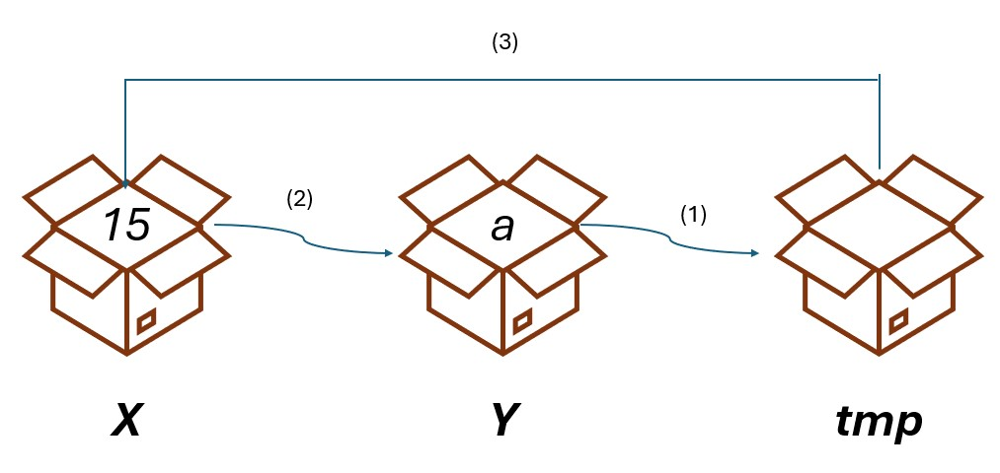

# Introduzione a python

Python è un linguaggio di programmazione **interpretato**: ogni istruzione scritta dal programmatore tramite i termini del linguaggio viene interpretata da un programma apposito (detto interprete) che la *converte* in una istruzione comprensibile per il calcolatore (che comprende il *linguaggio macchina*).


## Variabili

Una **variabile** è un contenitore di dati all'interno della memoria del dispositivo. Una variabile serve per "salvare" i dati ed è destinata ad essere utilizzata/modificata.


### Utilizzo di variabili

Per inserire dati all'intrno di variabili è possibile utilizzare l'operatore `=` ed effttuare una **assegnazione** come mostrato di seguito:

```
nome_variabile = valore
```

I dati contenuti nella variabili possono essere modificati tramite nuove assegnazioni:

```
var = 8
var = var + 1
```

Il nuovo valore di `var` è costituito dal suo valore precedente (8) a cui viene sommato 1. Si ottiene quindi 9.

>[!TIP]
>In python le variabili possono contenere qualsiasi tipo di dato (NON sono *tipizzate*) ciò significa che esse possono contenere numeri, stringhe oppure dati più complessi (strutture dati).

>[!WARNING]
>ATTENZIONE: durante l'assegnazione di un dato ad una variabile viene scelto anche il tipo di dato che le viene passato (intero, stringa, etc.). Tale scelta influisce sulle operazioni successive.

```
x = 15
x = x + 1		#Ora x vale 16

y = "1"
y = y + "1"		#Ora y vale "11"

z = 5
z = z + "3"		#ERRORE
```

### Scambio di variabili

Per scambiare due variabili è sempre necessaria una variabile temporanea di appoggio in cui salvare il valore di una delle due variabili di partenza.

```
a = 15
b = 20

tmp = a 		#Salvo il valore di a (15) in tmp
a = b 			#Inserisco in a il valore di b (20)
b = tmp 		#Inserisco in b il valore di tmp (15)
```



Senza la variabile temporanea, nel momento in cui il valore di una delle due variabili viene assegnato all'altra, il valore di una di esse viene irrimediabilmente perso:

```
a = 15
b = 20

b = a 			#Ora b vale 15, ma anche a vale ancora 15: il valore 20 è andato perduto per sempre!
```

## Operatori

## Input e Output dei dati

## Importare e utilizzare librerie